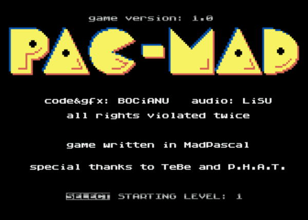
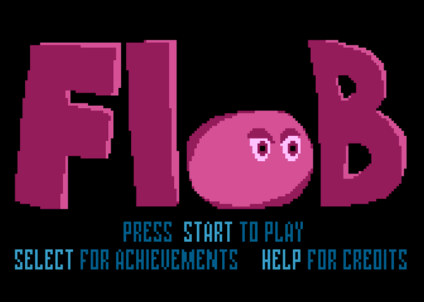

#

## Benchmark Suite

* autor: zbyti
* platforma: A8
* [źródła](https://github.com/zbyti/a8-mad-pascal-bench-suite)

## Star Vagrant

* autor: MADRAFi
* platforma: A8
* [strona domowa](http://madsoft.us/)
* [źródła](https://github.com/MADRAFi/StarVagrant)

## Stary Dom

* autor: bocianu
* platforma: A8
* [strona domowa](https://bocianu.atari.pl/blog/starydom)
* [źródła](https://gitlab.com/bocianu/oldmansion)

## Pac Mad

* autor: bocianu
* platforma: A8
* [strona domowa](https://bocianu.atari.pl/blog/pacmad)
* [źródła](https://gitlab.com/bocianu/PacMad)

## Flob

* autor: bocianu
* platforma: A8
* [strona domowa](https://bocianu.atari.pl/blog/flob)
* [źródła](https://gitlab.com/bocianu/flob)